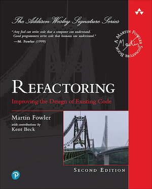

# Refactoring: A First Example

Code used in chapter 1 of Martin Fowler's book "Refactoring: Improving the Design of Existing Code."



To run the code example at the earlier stages of the refactoring (when you see a file named `statement.js`):
```
node statement.js
```

To run the code example at the later stages of the refactoring (when you see a file named `test.mjs`):
```
node --experimental-modules test.mjs
```
